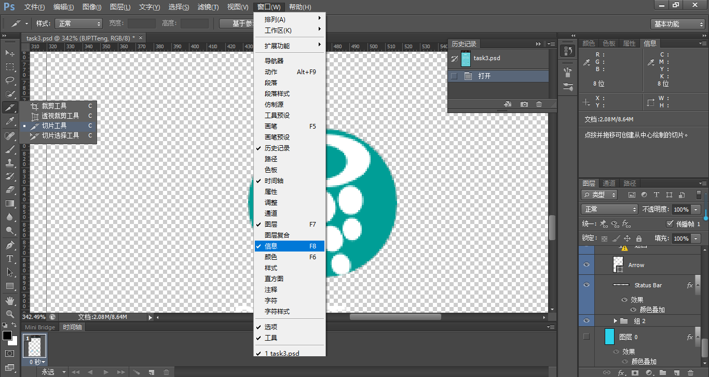
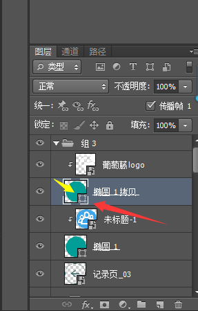
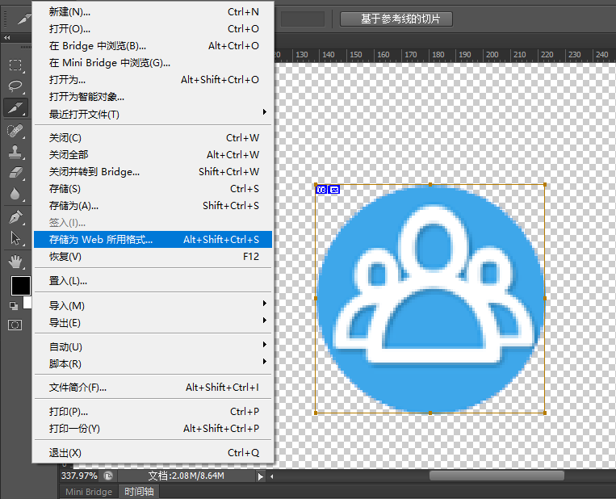
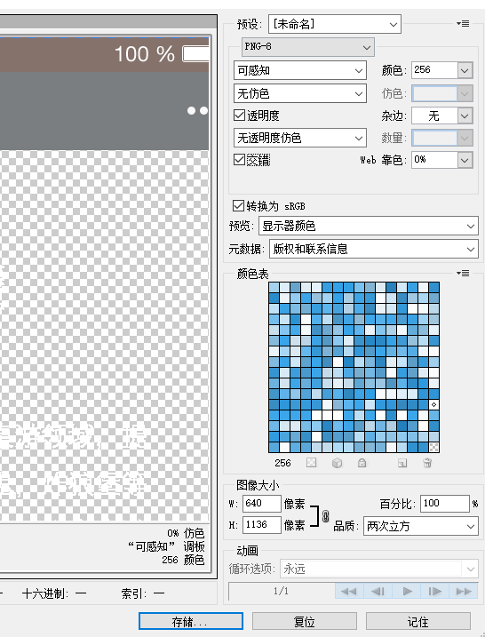

2017822
==
## 今天完成：
- task3和task4的rem+media布局

## 今天收获：
- [进一步了解rem+media布局](#rem-media)
	- [相关资料](#resources)
- [对PS切图进行了细微改进](#ps-skill)
- 尝试了github的markdown功能

## 遇到问题：
- 尚无

## 明天计划：
- 阅读有关布局的技术博客，task5继续推后


<h2 id="rem-media">自适应/响应式布局</h2>
### "自适应网页设计"的概念

2010年，Ethan Marcotte提出了"[自适应网页设计](https://alistapart.com/article/responsive-web-design)"（Responsive Web Design）这个名词，指可以自动识别屏幕宽度、并作出相应调整的网页设计。

这是他做出的一个[范例](https://alistapart.com/d/responsive-web-design/ex/ex-site-flexible.html)

### 相关的单位
* px像素（Pixel）。相对长度单位。像素px是相对于显示器屏幕分辨率而言的。(引自CSS2.0手册)
* em是相对长度单位。相对于当前对象内文本的字体尺寸。如当前对行内文本的字体尺寸未被人为设置，则相对于浏览器的默认字体尺寸。(引自CSS2.0手册)
* rem(root em)。CSS3新增的相对长度单位，相对于HTML根元素字体尺寸
* vw/vh。相对于视窗的宽度/高度：视窗宽度/高度为100vw

### 各单位优劣势
* px:
	- IE无法调整那些使用px作为单位的font-size；
	- 国外的大部分网站能够调整的原因在于其使用了em或rem作为字体单位；
	- Firefox能够调整px和em，rem，但是96%以上的中国网民使用IE浏览器(或内核)
	- 像素或许被认为是最好的"设备像素"，而这种像素长度和你在显示器上看到的文字屏幕像素无关。px实际上是一个按角度度量的单位。
* em:
	- em的值并不是固定的；
	- em会继承父级元素的font-size；
	- em大小可以指定到小数点后3位；
	- em可用来做弹性布局；
	- 浏览器默认font-size:16px，em值 = 1 ÷ 父元素的font-size × 需要转换的像素值
* rem:
	- rem比em更具有可控性，因为其直接相对于根font-size，避免了font-size套层的连锁反应；
	- 设置rem之后，只需更改根font-size就可以成比例调整所有font-size
	- 目前，除了IE8及更早版本外，所有浏览器均已支持rem。对于不支持它的浏览器，应对方法也很简单，就是多写一个绝对单位的声明。这些浏览器会忽略用rem设定的font-size。
* vw/vh:
	- 1vw=视窗宽度的1%；
	- 1vh=视窗高度的1%
	- 在一定情况下和%是没有区别的

### 常用的实现方式(以下只是我知道的方式)
* 允许宽度自动调整
```
　　<meta name="viewport" content="width=device-width, initial-scale=1" />
```
viewport的中文是【视口】，也就是网页的显示区域。但是viewport不局限于你所能看到的部分，有可能大于或者小于浏览器的可视范围

* 使用相对宽度
```
	width:xx%;
	width:xxvw;
	···
```

* 相对字体大小,如em、rem等

* CSS3引入的Media Query媒体查询模块，这是自适应网页的核心

* css的@media规则

* 图片自适应

<h2 id="resources">相关资料(按照排列顺序阅读)</h2>
- 博客

	- [自适应网页设计（Responsive Web Design）](http://www.ruanyifeng.com/blog/2012/05/responsive_web_design.html)
  
	- [响应式和自适应的区别](http://blog.csdn.net/bboyjoe/article/details/46501977)

	- [Css 单位](https://www.w3cschool.cn/cssref/css-units.html)

	- [px、em、rem区别介绍](http://www.runoob.com/w3cnote/px-em-rem-different.html)

	- [CSS中的em运用详解，1em等于多少像素？](http://www.17xsj.com/XHTML_CSS/CSSjiaocheng/2167.html)

	- [Rem VS Px](http://www.w3cplus.com/css/r-i-p-rem-viva-css-reference-pixel.html)

	- [视区相关单位vw, vh..简介以及可实际应用场景](http://www.zhangxinxu.com/wordpress/?p=2636)

	- [移动前端开发之viewport的深入理解](http://www.cnblogs.com/2050/p/3877280.html)


<h2 id="ps-skill">个人PS切图技巧(应该没有问题)</h2>
* PS按照下图操作，点开【窗口】的【信息】(F8)，左边的【切片工具】(shift+c按3次)，关闭右下角的【背景图层】(点那个眼睛)


* 右键下图的小方块选择【将缩略图剪切到图层边界】

* 利用刚才的切片工具去选定你所要的图案，之后【文件】的【存储为Web的所用格式】(ctrl+alt+shfit+s)

* 在右边的设置中,跟我的图一样就好

